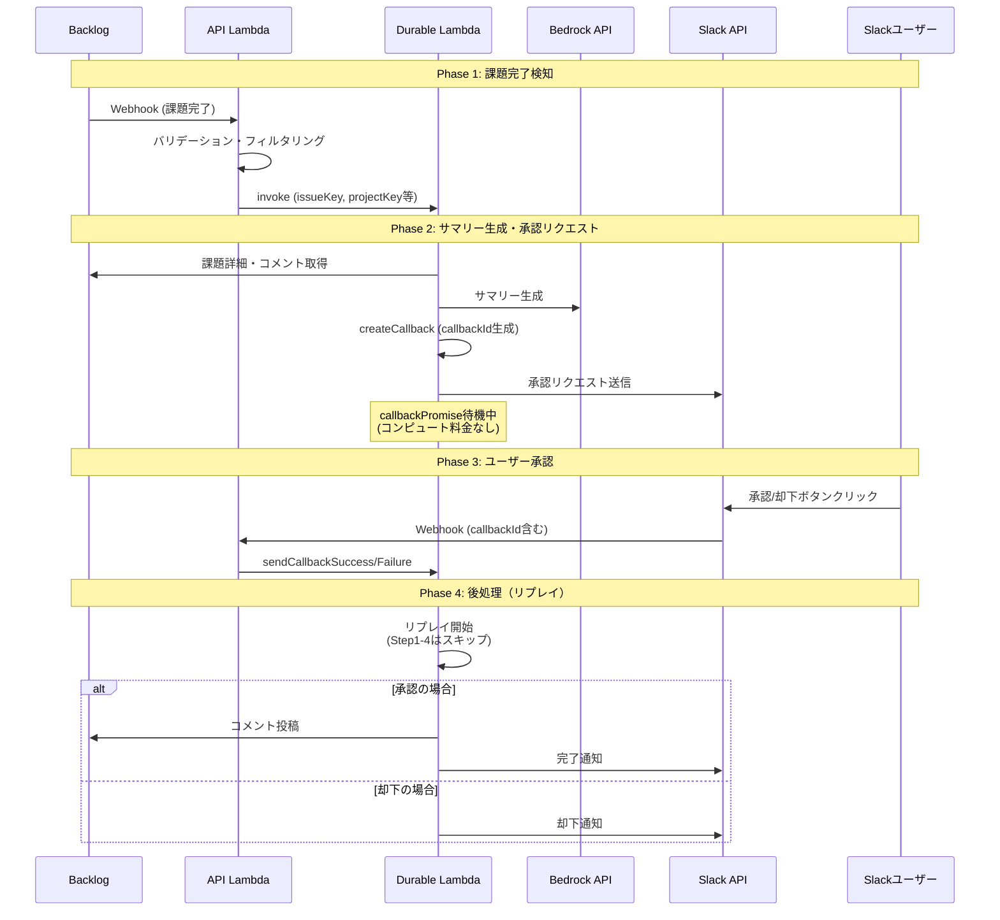

# Backlog課題完了通知システム アーキテクチャ

## システム概要

Backlogの課題が完了状態になった際に、AIがサマリーを生成し、Slackで承認フローを経てからBacklogにコメントを投稿するシステムです。

**主な機能:**
- Backlog課題完了の自動検知
- Amazon Bedrockによるサマリー自動生成
- Slackでの承認/却下フロー
- 承認後のBacklogコメント自動投稿

**使用技術:**
- AWS Lambda (API用 + Durable Functions用)
- AWS Lambda Durable Functions (長時間ワークフロー管理)
- Amazon Bedrock (Claude 3.5 Sonnet)
- Backlog API
- Slack API

---

## アーキテクチャ図



---

## 処理フロー詳細

### Phase 1: 課題完了検知

1. **Backlog Webhook受信**
   - Backlogで課題のステータスが変更されると、Webhookが送信される
   - API Lambda (`backlog-completion-api`) が受信

2. **バリデーション・フィルタリング**
   - イベントタイプが「課題更新」かチェック
   - ステータスが「完了」に変更されたかチェック
   - 条件を満たさない場合は無視

3. **Durable Function起動**
   - 条件を満たす場合、Durable Functionを非同期で起動
   - `issueKey`, `projectKey`, `issueSummary`, `issueDescription` を渡す

### Phase 2: サマリー生成・承認リクエスト

1. **課題詳細・コメント取得** (Step 1)
   - Backlog APIで課題の詳細情報を取得
   - 課題に紐づくコメント一覧も取得
   - チェックポイントとして保存

2. **サマリー生成** (Step 2)
   - 課題情報とコメントからプロンプトを構築
   - Amazon Bedrock (Claude 3.5 Sonnet) でサマリーを生成
   - チェックポイントとして保存

3. **コールバック作成** (Step 3)
   - `context.createCallback()` でコールバックIDを生成
   - 24時間のタイムアウトを設定

4. **Slack承認リクエスト送信** (Step 4)
   - 承認メッセージを構築（サマリー、承認/却下ボタン）
   - ボタンの `value` にコールバックIDを埋め込む
   - Slack APIでメッセージを送信
   - チェックポイントとして保存

5. **待機**
   - `callbackPromise` の解決を待機
   - 待機中はLambdaは停止し、コンピュート料金は発生しない

### Phase 3: ユーザー承認

1. **Slackボタンクリック**
   - ユーザーが「承認して投稿」または「却下」ボタンをクリック

2. **Slack Webhook受信**
   - API Lambda がSlackからのInteractive Messageを受信
   - ボタンの `value` からコールバックIDと承認結果を取得

3. **コールバック送信**
   - 承認の場合: `sendCallbackSuccess()` を呼び出し
   - 却下の場合: `sendCallbackFailure()` を呼び出し

### Phase 4: 後処理（リプレイ）

1. **リプレイ開始**
   - コールバックが解決されると、Durable Functionがリプレイ
   - Step 1〜4は完了済みのため、チェックポイントからスキップ

2. **承認時の処理**
   - Backlog APIでサマリーをコメントとして投稿 (Step 5)
   - Slackに完了通知を送信 (Step 6)

3. **却下時の処理**
   - `callbackPromise` が reject され、catch ブロックで処理
   - Slackに却下通知を送信

---

## コンポーネント一覧

### Handler層

| ファイル | 役割 |
|---------|------|
| `handler/api/handler.ts` | API Lambda エントリポイント |
| `handler/api/app.ts` | Honoアプリケーション構築 |
| `handler/api/route/webhook/backlog-webhook-handler.ts` | Backlog Webhook受信ハンドラー |
| `handler/api/route/webhook/slack-webhook-handler.ts` | Slack Webhook受信ハンドラー |
| `handler/durable/handler.ts` | Durable Function エントリポイント |

### UseCase層

| ファイル | 役割 |
|---------|------|
| `use-case/handle-backlog-webhook/handle-backlog-webhook-use-case.ts` | Backlog Webhook処理（イベント判定・Durable Function起動） |
| `use-case/handle-slack-webhook/handle-slack-webhook-use-case.ts` | Slack Webhook処理（コールバック送信） |
| `use-case/process-issue-completion/process-issue-completion-use-case.ts` | メインワークフロー（Durable Function内で実行） |

### Infrastructure層

| ファイル | 役割 |
|---------|------|
| `infrastructure/backlog-client.ts` | Backlog API クライアント |
| `infrastructure/bedrock-client.ts` | Amazon Bedrock クライアント |
| `infrastructure/slack-client.ts` | Slack API クライアント |
| `infrastructure/lambda-durable-function-client.ts` | Durable Function 呼び出しクライアント |

### Domain層

| ファイル | 役割 |
|---------|------|
| `domain/model/backlog/backlog-event.ts` | Backlog Webhookイベント型定義 |
| `domain/model/backlog/backlog-repository.ts` | Backlog Repository インターフェース |
| `domain/support/slack-notifier.ts` | Slack通知 インターフェース |
| `domain/support/summary-generator.ts` | サマリー生成 インターフェース |
| `domain/support/durable-function-client.ts` | Durable Function クライアント インターフェース |
| `domain/template/slack/approval-message.ts` | Slack承認メッセージテンプレート |
| `domain/template/slack/completion-message.ts` | Slack完了通知テンプレート |
| `domain/template/prompt/completion-summary-prompt.ts` | サマリー生成プロンプトテンプレート |

---

## Durable Functionsの仕組み

### Checkpoint/Replay機構

AWS Lambda Durable Functionsは、checkpoint/replay機構により長時間実行可能なワークフローを実現します。

```
[障害発生 or wait/callback完了]
        ↓
[関数を最初から再実行（リプレイ）]
        ↓
[完了済み step はスキップ、保存結果を使用]
        ↓
[未完了の処理から再開]
```

### 主要なDurable操作

| 操作 | 説明 |
|------|------|
| `context.step()` | ビジネスロジックにチェックポイントを設定。リプレイ時はスキップされる |
| `context.createCallback()` | 外部からの入力を待機するコールバックを作成 |
| `context.wait()` | 指定期間の待機（待機中はコンピュート料金なし） |

### なぜstepでラップするのか

外部APIへの呼び出し（副作用のある処理）は `context.step()` でラップすることで、障害発生時のリプレイで重複実行を防ぎます。

**例: 障害発生時のシナリオ**

1. callback が解決され、関数が再開
2. `post-backlog-comment` step が実行され、Backlog にコメント投稿
3. `send-completion-notification` step 実行前にLambdaがエラー終了
4. Durable Functions がリトライ → 関数を最初からリプレイ
5. `post-backlog-comment` は完了済みチェックポイントがあるのでスキップ（重複防止）
6. `send-completion-notification` から処理再開

---

## インフラストラクチャ

### Lambda関数

| 関数名 | 役割 | ログレベル |
|--------|------|-----------|
| `backlog-completion-api` | API用（Webhook受信） | DEBUG |
| `backlog-completion-durable` | Durable Function用（ワークフロー実行） | DEBUG |

### 環境変数

| 変数名 | 説明 | 設定元 |
|--------|------|--------|
| `BACKLOG_API_KEY` | Backlog APIキー | SSM Parameter Store |
| `BACKLOG_SPACE_ID` | BacklogスペースID | config.ts |
| `SLACK_BOT_TOKEN` | Slack Bot Token | SSM Parameter Store |
| `SLACK_CHANNEL_ID` | 通知先SlackチャンネルID | config.ts |
| `DURABLE_FUNCTION_NAME` | Durable Function名 | server-stack.ts |

### SSMパラメータ

秘匿情報はSSM Parameter Storeで管理:

- `/backlog-completion-notifier/BACKLOG_API_KEY`
- `/backlog-completion-notifier/SLACK_BOT_TOKEN`
